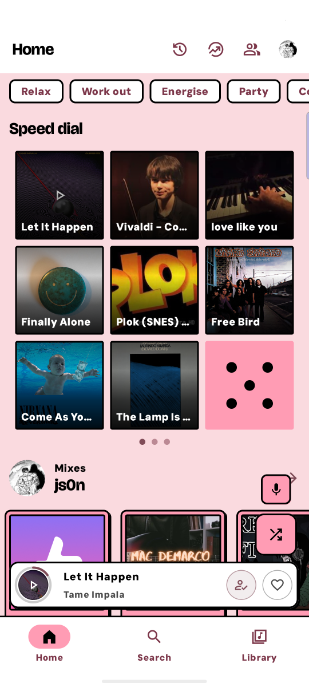
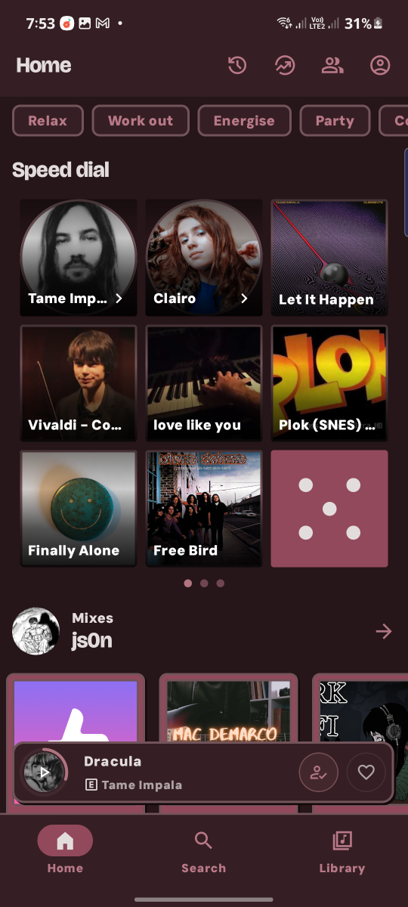
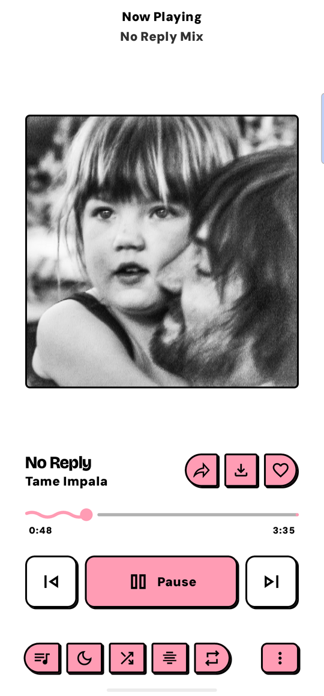
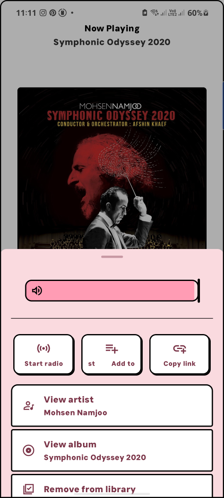
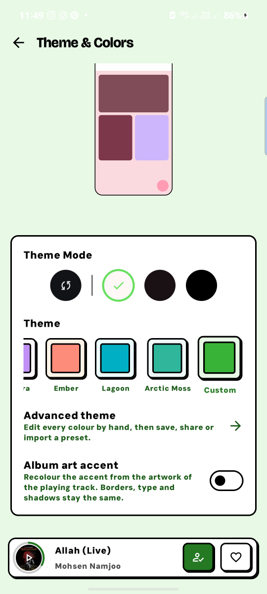
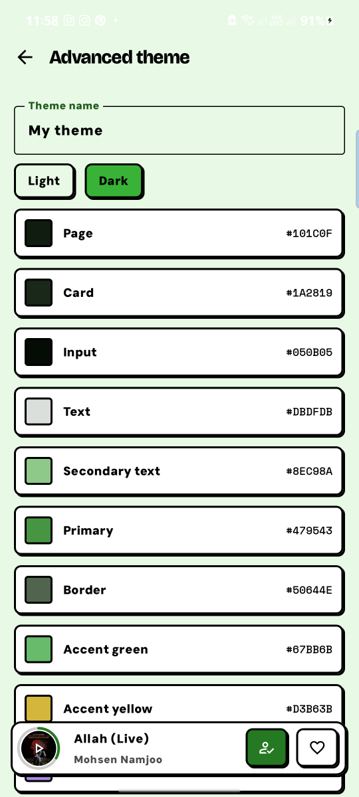

<div align="center">

# Ruzália

### Metrolist, wearing nuclear's skin

</div>

> [!IMPORTANT]
> **Unofficial.** Ruzália is a personal fork of [Metrolist](https://github.com/MetrolistGroup/Metrolist)
> and is **not affiliated with, endorsed by, or supported by** the Metrolist project or by
> [nuclear](https://github.com/nukeop/nuclear). Please do not raise Ruzália issues with either of them.
> It installs alongside Metrolist as a separate app (`com.ruzalia.music`), so you can keep both.

Ruzália is Metrolist — the same YouTube Music client, with the same streaming, downloads,
synced lyrics and equaliser — rebuilt to look like [nuclear](https://github.com/nukeop/nuclear),
the desktop player: chunky black outlines, hard zero-blur shadows, Bricolage Grotesque over
DM Sans, and a candy palette that starts at pink.

Nothing under the surface changed. Every feature is Metrolist's.

<div align="center">




</div>

---

## Installing

Grab the APK from [Releases](https://github.com/zjs0n-code/Ruzalia/releases) and install it.
Android will warn you about installing outside the Play Store; that is expected for any APK.

Ruzália installs **alongside** Metrolist rather than over it — different application id, so
both can sit on the same phone and neither touches the other's library.

The app checks this repository for its own updates. It will never offer you a Metrolist build:
those are signed with a different key and would not install over Ruzália anyway.

---

## The design

nuclear's look is neobrutalism, and all of it lives in CSS custom properties in
`packages/tailwind-config/global.css` plus five preset files. Ruzália ports the values
rather than approximating them:

| | |
|---|---|
| **Outline** | 2dp, drawn — not a tinted hairline |
| **Shadow** | offset 2dp, **zero blur**, and controls slide onto it when pressed |
| **Radii** | 4 / 8 / 12dp, capped — no pills, no circles |
| **Type** | Bricolage Grotesque for display, DM Sans for everything else, Space Mono for data |
| **Accents** | seven fixed hues keyed to light/dark, carrying meaning (red is error, green is downloaded) |

The colours are ports of nuclear's own OKLCH values, converted to sRGB. The five presets —
**Default**, **Aurora**, **Ember**, **Lagoon** and **Arctic Moss** — are the same structure at
five hues, exactly as nuclear builds them.

### Themes

<div align="center">


</div>

Beyond the five presets:

- **Custom colour.** Pick any colour and the whole palette is generated around it, using the
  same fixed lightness/chroma structure the presets share. The semantic accents are
  deliberately *not* rotated with your hue — otherwise "error" would turn green.
- **Advanced editor.** Every token gets a swatch and a hex value, edited separately for light
  and dark. Apply, share, or import.
- **Album art accent** (off by default) recolours the accent from the artwork of the playing
  track, leaving outlines, type and shadows alone.

Themes export as JSON shaped like nuclear's own advanced theme files, so they read as the same
kind of object and survive hand-editing:

```json
{
  "version": 1,
  "name": "My theme",
  "vars": { "background": "#FADADF", "primary": "#FF9CB4", "border": "#000000" },
  "dark": { "background": "#261519", "primary": "#92495B", "border": "#72545A" }
}
```

Missing tokens fall back to the default preset, so a partial file still loads.

## Building

Prerequisites: **JDK 21** and the Android SDK. The checked-in `development_guide.md` is
out of date — there are no git submodules any more, and the Gradle protobuf plugin fetches
`protoc` itself, so no local protobuf-compiler is needed.

```bash
git clone https://github.com/zjs0n-code/Ruzalia.git ruzalia && cd ruzalia

# compileSdk is 37
sdkmanager "platforms;android-37" "build-tools;37.0.0"

# local.properties
echo "sdk.dir=/path/to/Android/sdk" > local.properties

# stable debug signing, so rebuilds upgrade in place
keytool -genkeypair -v -keystore app/persistent-debug.keystore \
  -storepass android -keypass android -alias androiddebugkey \
  -keyalg RSA -keysize 2048 -validity 10000 \
  -dname "CN=Android Debug,O=Android,C=US"

./gradlew :app:assembleFossDebug
```

The APK lands at `app/build/outputs/apk/foss/debug/app-foss-debug.apk`.

> [!NOTE]
> A **debug** build is noticeably slower than a release build — Compose especially. If you are
> comparing against a released copy of Metrolist and Ruzália feels heavy, that is the build
> type, not the skin. Build the release variant to compare fairly.

Tests: `./gradlew :app:testFossDebugUnitTest`

## Staying current with Metrolist

Ruzália is a fork, not a re-implementation, so new Metrolist features arrive by merging
upstream in and rebuilding — they do not appear on their own. What you get from a Ruzália
release is *Metrolist at whatever version it was merged from, wearing this skin*.

The Kotlin namespace is deliberately still `com.metrolist.music`; only the `applicationId`
changed. That keeps the diff down to the theme package plus a couple of dozen UI files, which
is what makes merging upstream tractable rather than a rewrite each time:

```bash
git remote add upstream https://github.com/MetrolistGroup/Metrolist.git
git fetch upstream --tags
git merge v13.7.0        # whichever release you are moving to
```

Conflicts land almost entirely in the reskinned UI files, and the rule for resolving them is
usually "take upstream's logic, keep Ruzália's appearance". Rebuild and check the screens the
merge touched before releasing.

## Credits and licence

- **[Metrolist](https://github.com/MetrolistGroup/Metrolist)** by MetrolistGroup — everything
  this app actually does. GPL-3.0.
- **[nuclear](https://github.com/nukeop/nuclear)** by nukeop — the design language this app
  wears. AGPL-3.0. Only the visual design is reproduced here, reimplemented in Kotlin; no
  nuclear code is included, and the Ruzália mark is its own, not nuclear's.
- **Fonts** — [Bricolage Grotesque](https://github.com/ateliertriay/bricolage),
  [DM Sans](https://github.com/googlefonts/dm-fonts) and
  [Space Mono](https://github.com/googlefonts/spacemono), all under the SIL Open Font License.
  Licence texts ship in `app/src/main/assets/licenses/`.

Ruzália is **GPL-3.0**, like its upstream. See [LICENSE](LICENSE).
